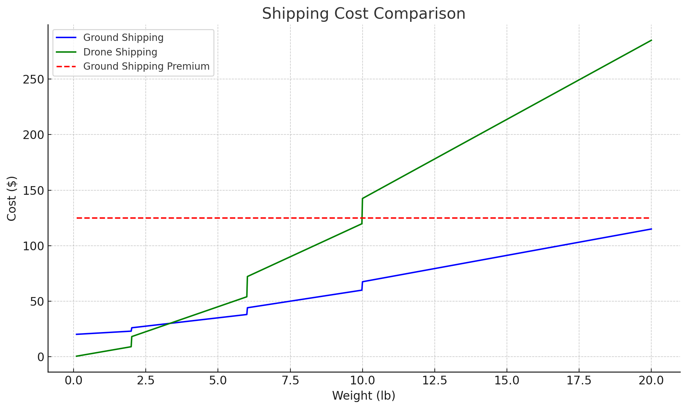

# Shipments
A shipment program I created that takes in user input for wieght amounts and determines the cheapest shipment cost based on information I was provided from a set of data.

I have attached a graph to show you that a test case has appeared where two points intersect causing two shipment methods to be the cheapest option!
